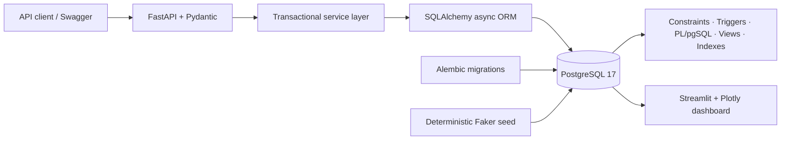

# Food Delivery Order & Analytics Management System

A database-first, resume-ready simulation of a Swiggy/Zomato-style platform. The project treats order placement, fulfillment, payments, reviews, coupons, and analytics as relational-data problems: PostgreSQL enforces the important invariants, FastAPI exposes transactional workflows, and Streamlit visualizes operational KPIs.

> Scope: intermediate DBMS engineering—not a frontend clone and not a distributed-systems demo.

## Why this project

Food delivery has unusually rich database behavior: an order snapshots mutable prices, follows a guarded state machine, touches payment and agent availability atomically, generates an audit trail, and later feeds retention and operations analysis. That makes it a practical demonstration of schema design and SQL beyond CRUD.

## Architecture



The API is asynchronous through `asyncpg`; migrations, seed generation, tests, and the dashboard use the synchronous PostgreSQL driver where appropriate.

## Key features

- Customer registration with bcrypt password hashing and multi-address management
- Restaurant catalog, restaurant-scoped categories, and availability-aware menus
- Multi-item checkout with immutable price snapshots and server-side totals
- Coupon validation with row locking, validity windows, limits, minimum values, and caps
- Guarded eight-state order lifecycle with automatic status history
- Exclusive delivery-agent assignment using locking and a partial unique index
- One payment lifecycle per order, including failure and refund states
- Delivered-order-only restaurant and delivery reviews with aggregate-rating triggers
- 31 analytical SQL queries, four reusable views, and six analytics API routes
- Deterministic data generator: 100 users, 20 restaurants, 240 menu items, 25 agents, 1,200 orders
- Five-page Streamlit/Plotly analytics dashboard
- Alembic, pytest, Docker, health checks, and one-command local startup

## Database design

The schema contains 14 tables:

| Area | Tables | Purpose |
|---|---|---|
| Customer | `users`, `addresses` | identity and reusable destinations |
| Catalog | `restaurants`, `menu_categories`, `menu_items` | restaurant-scoped menu hierarchy |
| Fulfillment | `orders`, `order_items`, `order_status_history`, `delivery_agents` | financial snapshot and audited lifecycle |
| Money | `payments`, `coupons`, `order_coupons` | payment state and coupon redemption |
| Feedback | `restaurant_reviews`, `delivery_reviews` | delivered-order-verified ratings |

The complete Mermaid ER diagram is in [docs/er_diagram.md](docs/er_diagram.md). The model is in Third Normal Form; intentional snapshots/caches and their integrity mechanisms are explained in [docs/normalization.md](docs/normalization.md).

## Transactional workflows

### Place order

Within one SQLAlchemy transaction the service validates the active restaurant, customer-owned address, item existence/availability/restaurant ownership, locks and applies a valid coupon, calculates `Decimal` totals, creates the order and line snapshots, creates a pending payment, records the redemption, and relies on the audit trigger for initial history. Any failure rolls back the whole unit.

### Cancel order

The order row is locked, the state transition is checked, successful payment is changed to `REFUNDED`, any agent is released, cancellation is timestamped, and history is audited in the same commit.

### Complete delivery

Only `OUT_FOR_DELIVERY → DELIVERED` is permitted. The transaction timestamps delivery and makes the assigned agent `AVAILABLE`; the status trigger writes the audit event.

These flows demonstrate **atomicity** (all-or-nothing writes), **consistency** (constraints/state rules), **isolation** (`FOR UPDATE` for contested rows), and **durability** (PostgreSQL commits/WAL). More detail is in [docs/database_design.md](docs/database_design.md).

## Database-native behavior

### Constraints

Primary/foreign keys, uniqueness, `NOT NULL`, defaults, enum types, and CHECK constraints protect identifiers, money, ratings, quantities, coordinates, coupon ranges, and date windows. Partial unique indexes allow one default address per user and one active order per agent.

### Triggers

- Status history after order insertion or status change
- Legal state-transition enforcement before status changes
- Restaurant rating recalculation after restaurant-review insert/update/delete
- Agent rating recalculation after delivery-review insert/update/delete
- Order-line total derivation before insert/update
- Order financial identity validation before insert/update
- Cross-table category and delivered-review ownership validation

### PL/pgSQL and SQL functions

- `calculate_order_total(order_id)`
- `get_restaurant_monthly_revenue(restaurant_id, year, month)`
- `get_customer_lifetime_value(user_id)`
- `get_agent_performance(agent_id)`
- `apply_coupon(coupon_code, order_value)`

### Views

- `restaurant_performance_view`
- `customer_summary_view`
- `delivery_agent_performance_view`
- `daily_sales_view`

### Indexing and optimization

Foreign-key join paths, status/time filters, restaurant time-series access, review lookup, and payment lookup are indexed. A composite restaurant/time index and selective partial indexes demonstrate more than single-column indexing. [docs/database_design.md](docs/database_design.md) provides two reproducible `EXPLAIN (ANALYZE, BUFFERS)` comparisons and explains sequential scans, index scans, composites, selectivity, and write/storage costs.

## Analytics

[sql/analytics.sql](sql/analytics.sql) contains 31 labeled queries using joins, correlated sets, `GROUP BY`, `HAVING`, CASE/filter logic, date arithmetic, ordinary and recursive CTEs, and `RANK`, `DENSE_RANK`, `ROW_NUMBER`, running `SUM`, and `LAG` windows.

Coverage includes restaurant revenue/order rank, AOV, daily/monthly trends, menu/cuisine popularity, peak hour/weekday, repeat-order rate, LTV, customer ranks, month-over-month growth, preparation/delivery duration, agent rank, cancellations, payment mix, coupons, rating-versus-revenue, dormant users, top-three items per restaurant, revenue contribution, first-order cohorts, inter-order time, restaurant repeat rate, and hourly delivery delay.

## REST API

Interactive OpenAPI documentation is available at `http://localhost:8000/docs`.

| Method | Endpoint | Purpose |
|---|---|---|
| POST | `/users` | register customer |
| GET | `/users/{id}` | customer details |
| GET | `/users/{id}/orders` | order history |
| POST | `/users/{id}/addresses` | add address |
| POST | `/restaurants` | create restaurant |
| GET | `/restaurants` | list/filter restaurants |
| GET | `/restaurants/{id}` | restaurant details |
| GET | `/restaurants/{id}/menu` | availability-aware menu |
| POST | `/restaurants/{id}/menu-items` | add menu item |
| PATCH | `/menu-items/{id}` | update price/availability/details |
| POST | `/orders` | transactional checkout |
| GET | `/orders/{id}` | order, lines, and payment |
| GET | `/orders` | filter by status, restaurant, user, and date range |
| PATCH | `/orders/{id}/status` | guarded transition/agent assignment |
| POST | `/orders/{id}/cancel` | atomic cancel/refund/release |
| POST/GET | `/orders/{id}/payment` | record/read payment |
| POST | `/orders/{id}/restaurant-review` | delivered-order review |
| POST | `/orders/{id}/delivery-review` | delivered-order agent review |
| GET | `/analytics/restaurants` | restaurant performance view |
| GET | `/analytics/restaurants/{id}?year=&month=` | monthly restaurant revenue |
| GET | `/analytics/customers/{id}` | summary and lifetime value |
| GET | `/analytics/delivery-agents/{id}` | agent performance function |
| GET | `/analytics/sales/daily` | daily sales view |
| GET | `/analytics/sales/monthly` | monthly sales series |

Errors use appropriate `404`, `409`, and `422` responses; database uniqueness/integrity errors are centralized.

## Dashboard

Open `http://localhost:8501` after Compose starts:

- **Overview:** revenue, orders, customers, restaurants, AOV, cancellation rate
- **Sales:** daily/monthly revenue and weekday/hour volume
- **Restaurants:** top revenue/orders, rating relationship, cancellation rate
- **Customers:** spend, frequency, repeat share, and acquisition trend
- **Delivery:** average duration, agent volume/ratings, and hourly delays

## Project structure

```text
food-delivery-dbms/
├── app/                  # FastAPI app, ORM entities, schemas, routers, services
├── alembic/              # versioned migration executing canonical SQL
├── dashboard/app.py      # Streamlit + Plotly dashboard
├── docs/                 # ERD, normalization, design, query guide
├── scripts/seed.py       # deterministic realistic bulk seed
├── sql/                  # schema, constraints, indexes, triggers, functions, views, analytics
├── tests/                # unit and PostgreSQL integration tests
├── .env.example
├── alembic.ini
├── docker-compose.yml
├── Dockerfile
├── pytest.ini
└── requirements.txt
```

## Run with Docker

Prerequisite: Docker Desktop/Engine with Compose v2.

```bash
git clone <your-repository-url>
cd food-delivery-dbms
cp .env.example .env
docker compose up --build
```

The API container waits for PostgreSQL, runs `alembic upgrade head`, seeds only when fewer than 1,000 orders exist, then starts Uvicorn. Services:

- API and Swagger: `http://localhost:8000/docs`
- Streamlit: `http://localhost:8501`
- PostgreSQL: `localhost:5433` by default (configurable with `POSTGRES_PORT`)

Reset all local container data and reseed:

```bash
docker compose down -v
docker compose up --build
```

## Run locally

```bash
python -m venv .venv
# Windows: .venv\Scripts\activate
# macOS/Linux: source .venv/bin/activate
pip install -r requirements.txt
cp .env.example .env              # change DB hosts from db to localhost
alembic upgrade head
python scripts/seed.py
uvicorn app.main:app --reload
streamlit run dashboard/app.py
```

## Deploy to Render

The repository includes a root-level `render.yaml` Blueprint that provisions a
free Render PostgreSQL database plus separate Docker services for FastAPI and
Streamlit in the Singapore region. Database credentials are injected through
Render's `fromDatabase` references and are never committed.

1. Push this repository to GitHub.
2. Open Render's **New Blueprint** page and connect the repository.
3. Confirm the three resources declared in `render.yaml`.
4. Deploy the Blueprint. The API command runs Alembic and the idempotent seed
   before starting Uvicorn; subsequent pushes automatically redeploy both apps.

Render assigns public `onrender.com` URLs to the API and dashboard. Free
services can take time to wake after inactivity and are intended for portfolio
demonstrations rather than production workloads.

## Tests

Fast unit tests run without PostgreSQL. Integration tests require a disposable migrated PostgreSQL database so trigger and rollback behavior are real, not mocked:

```bash
pytest -m "not integration"
TEST_DATABASE_URL=postgresql+asyncpg://... pytest -m integration
```

## DBMS Concepts Demonstrated

- ER modelling
- relational schema design
- 3NF normalization
- PK/FK constraints
- CHECK and UNIQUE constraints
- ACID transactions
- transaction rollback
- triggers
- PL/pgSQL functions
- SQL views
- indexes
- EXPLAIN ANALYZE
- joins
- subqueries
- CTEs
- window functions
- aggregation
- analytical SQL

## Suggested GitHub screenshots

1. Mermaid ER diagram rendered on GitHub
2. Swagger `/docs` with the Orders and Analytics groups expanded
3. Overview dashboard KPI strip and daily-revenue area chart
4. Restaurant rating/revenue bubble chart
5. Delivery agent performance page
6. `EXPLAIN (ANALYZE, BUFFERS)` before/after plan comparison
7. SQL result for monthly growth or top-three items per restaurant

Store images in a future `docs/screenshots/` directory and embed them here after running the stack.

## Future improvements

- JWT-based role authorization for customers, restaurants, and operators
- PostGIS distance-aware restaurant discovery and delivery-fee calculation
- Materialized views for high-volume historical dashboard queries
- Coupon eligibility by restaurant/customer segment
- Table partitioning for very large order and status-history tables

## Resume bullets

- Designed a 3NF PostgreSQL schema for a food-delivery platform spanning customer addresses, restaurant menus, multi-line orders, payment/refund lifecycles, coupon redemptions, delivery operations, and verified reviews, backed by comprehensive relational constraints.
- Engineered ACID-compliant checkout, cancellation, and fulfillment workflows with row-level locking, rollback safety, guarded state transitions, audit/rating/financial triggers, PL/pgSQL functions, reusable views, and workload-driven composite/partial indexes.
- Built an asynchronous FastAPI service and Streamlit analytics dashboard over 1,200 realistic multi-month orders, using 31 documented analytical queries with CTEs and window functions to measure revenue, retention, cohorts, menu demand, cancellations, and delivery performance.
