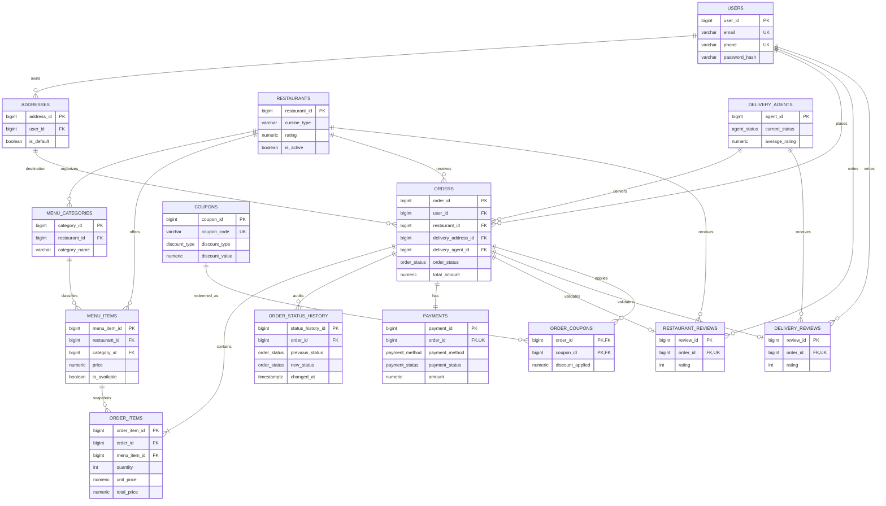

# Entity–Relationship Diagram

The one-review-per-order constraints make both review relationships optional one-to-one from an order. `ORDER_COUPONS` remains a junction table even though the current API applies at most one coupon; this preserves a clean relational model if stacking is later introduced.

